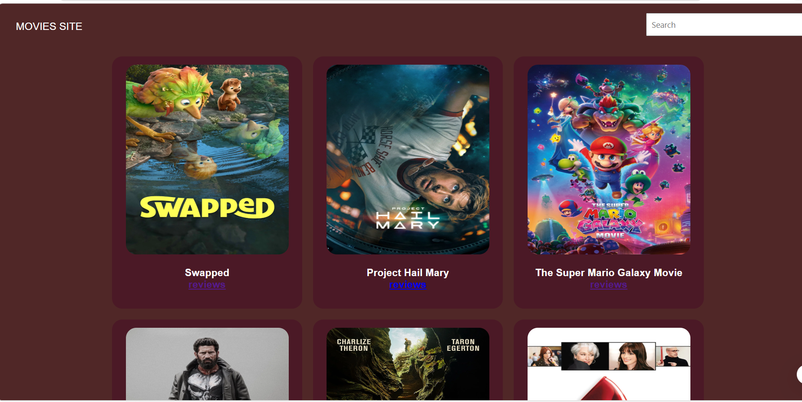
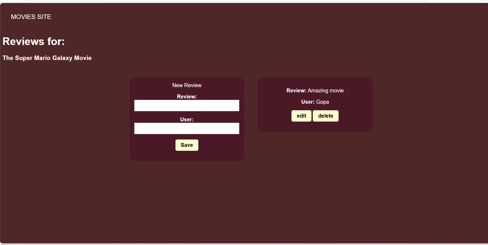

#  Movie Review Site

A full-stack Movie Review Web Application where users can search movies, view movie details, and add reviews. Users can also edit and delete their reviews. The project uses the TMDB API to fetch movie data.

---

##  Features

-  Search movies
-  Add reviews
-  Edit reviews
-  Delete reviews
-  Frontend & Backend Integration
-  Responsive Design

---

##  Tech Stack

### Frontend
- HTML
- CSS
- JavaScript

### Backend
- Node.js
- Express.js

### API
- TMDB API

### Database
- MongoDB

---

##  Project Structure

```bash
movie-review-site/
│
├── public/
│   ├── index.html
│   ├── style.css
│   └── script.js
│
├── api/
│   ├── reviews.route.js
│   ├── reviews.controller.js
│   └── reviews.dao.js
│
├── server.js
├── package.json
└── README.md
```

---

##  Installation

### 1. Clone the repository

```bash
git clone https://github.com/your-username/movie-review-site.git
```

### 2. Navigate to the project folder

```bash
cd movie-review-site
```

### 3. Install dependencies

```bash
npm install
```

### 4. Create a `.env` file

```env
TMDB_API_KEY=your_tmdb_api_key
MONGO_URI=your_mongodb_connection
PORT=8000
```

### 5. Run the server

```bash
npm start
```

---

##  API Used

- TMDB API  
https://www.themoviedb.org/

---

##  Screenshots

Add your project screenshots here.

| Home Page | Review Section |
|-----------|----------------|
|  |  |

---

##  Future Improvements

- User Authentication
- Movie Ratings
- Watchlist Feature
- Dark Mode
- Better UI/UX

---

##  Author

### Gopa Dutta

- GitHub: https://github.com/Gopa16

